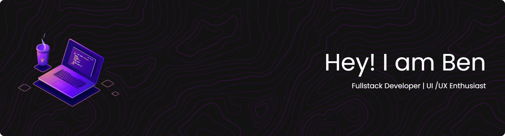

<!--
**benedictusron/benedictusron** is a ✨ _special_ ✨ repository because its `README.md` (this file) appears on your GitHub profile.

Here are some ideas to get you started:

- 🔭 I’m currently working on ...
- 🌱 I’m currently learning ...
- 👯 I’m looking to collaborate on ...
- 🤔 I’m looking for help with ...
- 💬 Ask me about ...
- 📫 How to reach me: ...
- 😄 Pronouns: ...
- ⚡ Fun fact: ...
-->

## Hi there! 👋

I'm **Ben**! A passionate developer from **Indonesia**, currently diving deep into the world of coding. My mantra is 'Learning by doing...' and I'm excited to share my journey with you!

## About Me

I'm a self-taught developer with a focus on practical application and hands-on experience. Based in Indonesia, I'm exploring various technologies and honing my skills. My journey in coding is fueled by curiosity and a love for problem-solving.

## Skills & Technologies

## Connect with Me

